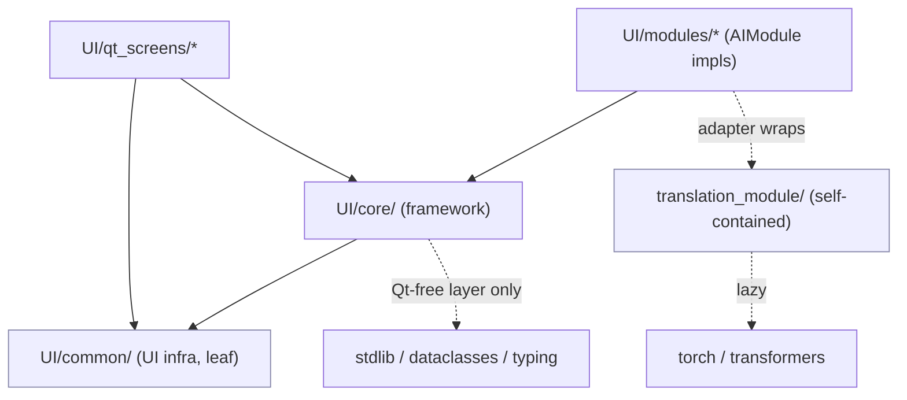
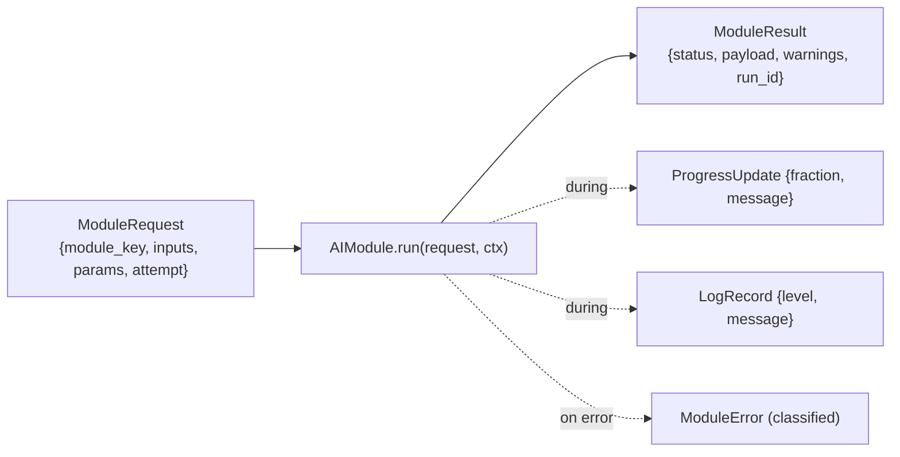
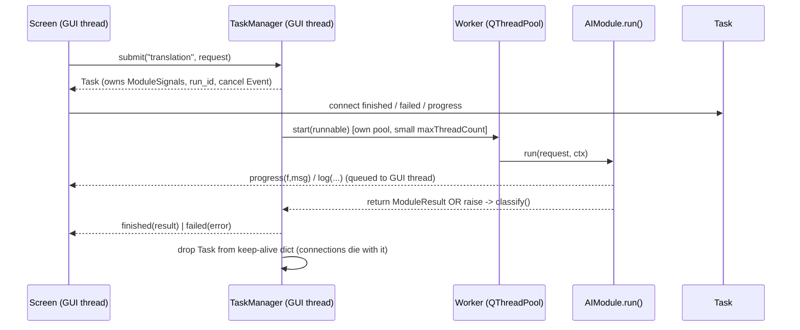

# Backend & Integration Architecture

This document maps **every dependency** in the project — external packages, the
internal package layout, who-imports-whom, the module/data contracts, and the
runtime data flow — so that AI-module developers (image, video, audio,
subtitles, translation, motion, character packs, timeline…) can plug their work
in without touching UI code or breaking the app.

Legend: **[built]** = exists in the repo today · **[planned]** = the integration
layer described in the approved plan (`.claude/plans/…`), not yet implemented.

---

## 1. External / runtime dependencies

### 1.1 UI application (`UI/`) — declared in `requirements.txt`
| Package | Version | Used for |
|---|---|---|
| `PySide6` | `>=6.7` | Qt widgets, signals/slots, `QThreadPool`, layout direction (RTL/LTR) |
| `Pillow` | `>=12.0` | Placeholder-asset generation (`UI/assets/generate_*.py`) |
| `arabic-reshaper` | `>=3.0` | Correct Arabic glyph shaping for previews |
| `python-bidi` | `>=0.4` | Bidirectional (RTL) text ordering |

The UI uses **only the Python standard library + PySide6** at runtime. It does
**not** import `torch`, `transformers`, or any model. That isolation is
deliberate: the app launches and every screen renders on a machine with no GPU
and no models installed.

### 1.2 Translation module (`translation_module/`) — real AI module, heavy deps
Not pinned in `requirements.txt` (optional, installed only where translation
runs). Imported **lazily** inside functions so importing the package never
forces these to load:
| Package | Used for | Import site |
|---|---|---|
| `torch` | Tensor compute, device selection (CUDA/MPS/CPU) | `nllb_loader.py`, `translator.py` (inside methods) |
| `transformers` | `AutoModelForSeq2SeqLM`, `AutoTokenizer` (NLLB-200) | `nllb_loader.py` (inside `load_model`) |

Model: `facebook/nllb-200-distilled-600M` (or a local path).

> **Rule for module authors:** import heavy/optional dependencies **inside the
> method that needs them**, never at module top level. Raise a typed error
> (see §4.2) if the import fails. This is why the UI stays importable without
> `torch`.

---

## 2. Internal package layout & dependency direction

```
Offline/
├── UI/                         # PySide6 desktop app
│   ├── hasaballa_desktop_app.py   [built]  shell: QMainWindow + sidebar + QStackedWidget
│   ├── common/                    [built]  shared UI infra (leaf layer)
│   │   ├── workers.py                 Worker(QRunnable) + WorkerSignals(finished,error)
│   │   ├── i18n.py                    lang_manager singleton + t(key)  (AR⇄EN)
│   │   ├── connection.py              connection_manager singleton (Local/Online/Cloud)
│   │   ├── qt_theme.py / qt_widgets.py / style.py / eta.py / compliance.py …
│   │   └── (toggle_switch, language_toggle, scenes, voices, sound_library …)
│   ├── qt_screens/                [built]  19 screens (placeholders / mockups)
│   ├── core/                      [planned] the integration framework  (see §3)
│   ├── modules/                   [planned] built-in AIModule implementations (stub + adapters)
│   ├── docs/                      [planned] ARCHITECTURE.md, INTEGRATION_GUIDE.md
│   └── tests/                     [planned] smoke + headless module tests
└── translation_module/          [built]  real NLLB module — the "real module" template
    ├── models.py                     dataclasses + SubtitleFormat enum + exception hierarchy
    ├── nllb_loader.py                thread-safe singleton model loader (lazy torch)
    ├── translator.py                 SubtitleTranslator (constructor injection: loader=)
    ├── parser.py / subtitle_merger.py / exporter.py / utils.py
    └── __init__.py                   clean public API (__all__)
```

### 2.1 Allowed import directions (must not create cycles)



**Hard rules**
- `common/` is a **leaf**: it imports Qt and itself, **never `core/`**.
- `core/` may import `common/workers`; it must **never** be imported by `common/`.
- `translation_module/` is fully self-contained (no UI imports); `UI/modules/`
  wraps it via an adapter, so the dependency points UI → module, never back.
- Screens depend on both `core/` and `common/`.

### 2.2 `core/` sub-layering (prevents `core/ ↔ common/` cycles)

| Layer | Files | Imports PySide6? | Why |
|---|---|---|---|
| **Qt-free** | `contracts.py`, `errors.py`, `validation.py`, `module.py` | ❌ No | Importable by pure modules and headless tests (no `QApplication`) |
| **Qt-coupled** | `events.py`, `execution.py`, `services.py`, `config.py`, `files.py`, `screen_base.py` | ✅ Yes | Signals, threading, widgets |

Because the contracts/errors/module-base a module touches are **Qt-free**, a
module `run()` never drags Qt in and is unit-testable with a fake context.

---

## 3. The integration framework (`UI/core/`) — [planned]

One package that supplies everything a module needs to plug in. Each file maps
directly to one of the required backend concerns.

| File | Concern | Key exports |
|---|---|---|
| `contracts.py` | **Standard IO contracts** | `MediaRef`, `TextData`, `ImageData`, `ImageSet`, `VideoData`, `AudioData`, `SubtitleData`, `JsonData`, `CsvData`, `CharacterPack`, `TimelineData`, `ModuleRequest`, `ModuleResult`, `ProgressUpdate`, `LogRecord` — all `@dataclass(frozen=True, slots=True)` |
| `errors.py` | **Error framework** | `ModuleError` (i18n key + params + `recoverable`), `RecoverableError`, `FatalError`, `ValidationError`, `classify(exc)` boundary adapter |
| `validation.py` | **Validation** | `ValidationResult`; `file_exists`, `valid_file_type`, `supported_format`, `model_present`, `param_present`, `non_empty_prompt`, `output_path_writable` |
| `module.py` | **Module interface** | `AIModule` (abstract: `key/name/version/input_types/output_types`, `validate()`, `run(request, ctx)`); `TaskContext` (`typing.Protocol`) |
| `events.py` | **Event system / signals** | `ModuleSignals(QObject)`: `started`, `progress(float,str)`, `finished(object)`, `failed(object)`, `warning(str)`, `log(object)`, `preview_ready(object)`, `output_ready(object)` |
| `execution.py` | **Async execution** | `TaskManager` (own `QThreadPool`), `Task` (per-run `ModuleSignals` + `run_id` + cancel `Event`), `_TaskContext` (plain object) |
| `services.py` | **Dependency injection** | `ServiceContainer` + `ModuleRegistry` (register/get by key); assembly only |
| `config.py` | **Configuration** | `AppConfig` singleton (JSON, atomic write): model paths, cache/export/temp/input/projects dirs, language, theme, internet mode, prefs |
| `files.py` | **File management** | `FileManager`: managed dirs, path helpers, supported-format registry, validation |
| `screen_base.py` | **UI integration standards** | `IntegrationScreen` mixin: `initialize/bind_events/load_data/update_progress/show_preview/show_result/reset/cleanup` |

### 3.1 Module interface contract

```python
class AIModule(ABC):
    key: str            # registry id, e.g. "translation"
    name: str           # human name / i18n key
    version: str
    input_types:  tuple # contract types accepted
    output_types: tuple # contract types produced

    def validate(self, request: ModuleRequest) -> ValidationResult: ...
    def run(self, request: ModuleRequest, ctx: TaskContext) -> ModuleResult: ...
```

`TaskContext` (passed into `run`, called from the worker thread):
`ctx.report_progress(fraction, msg)` · `ctx.check_cancelled()` ·
`ctx.log(record)` · `ctx.config` · `ctx.files`.

Modules are **stateless services** kept in the registry; **per-run state lives on
the `Task`, never on the module**, and dependencies arrive via `ctx` — modules
never import widgets or the container.

---

## 4. Data & error contracts (dependency shapes)

### 4.1 Standard IO envelopes



`payload` carries one of the concrete contract types (`TextData`,
`SubtitleData`, `ImageSet`, `VideoData`, …). Every emitted object is **frozen**
so cross-thread signal delivery is race-free.

### 4.2 Error hierarchy & boundary adapter

```
Exception
 └─ ModuleError            (i18n key + params, recoverable flag, dev detail)   [planned, core/errors.py]
     ├─ RecoverableError   (retryable — e.g. transient translate failure)
     ├─ FatalError         (unrecoverable — wraps unknown exceptions)
     └─ ValidationError    (bad/missing input, surfaced pre-run)

TranslationModuleError    [built, translation_module/models.py]  ← module keeps its own
 ├─ SubtitleParsingError · InvalidTimestampError · EmptySubtitleError
 ├─ UnsupportedLanguageError · ModelLoadError · SubtitleExportError · TranslationError
```

`core.errors.classify(exc)` maps **any** raised exception (including the native
`TranslationModuleError` tree) into `Recoverable`/`Fatal`/`Validation` — so real
module authors keep raising their own exceptions and still flow through the UI's
error path. Messages carry an **i18n key**, not a rendered string, so they flip
AR⇄EN via `common.i18n.t()`.

---

## 5. Async execution dependency (threading model)



**Threading rules (why the dependencies are shaped this way)**
- `ModuleSignals` is a **`QObject` created on the GUI thread**, one per run; slots
  deliver on the GUI thread via Qt's queued connections.
- `TaskContext` is a **plain object, not a `QObject`** — it runs on the worker
  thread and emits through the task's GUI-affinity signals.
- Cancellation is **cooperative**: a `threading.Event` polled by
  `ctx.check_cancelled()` (`QRunnable` can't be preempted).
- `TaskManager` **holds each `Task` alive until settle**, then drops it —
  mirrors the existing keep-alive/`_op_token` idiom in `common/connection.py`
  and avoids the `autoDelete` GC crash `common/workers.py` guards against.
- A **`run_id` correlation token** lets a late callback from a superseded run be
  ignored. GPU-bound modules are **single-flight per module key**.
- `TaskManager` uses **its own `QThreadPool`**, leaving
  `QThreadPool.globalInstance()` free for the lightweight connection helper.

---

## 6. What exists today vs. what the framework adds

| Concern | Today `[built]` | With `core/` `[planned]` |
|---|---|---|
| Async | bare `Worker` (finished/error only); each screen re-writes `_run_worker` | `TaskManager` with progress, cancel, queue, keep-alive, run tokens |
| Module interface | none (screens fake work with `time.sleep`/`QTimer`) | `AIModule` + registry + DI |
| IO contracts | ad-hoc dicts per screen | frozen dataclass contracts |
| Errors | `str` messages | i18n-keyed `ModuleError` + `classify()` adapter |
| Config | hardcoded `D:/Models/…` in `settings_screen.MODELS` | `AppConfig` (JSON, atomic) — settings migration is a follow-up |
| Files | `Path(__file__)` + `QFileDialog` per screen | `FileManager` managed dirs + format registry |
| Screen lifecycle | implicit `set_dark`/`retranslate`/`set_navigator` via `hasattr` | `IntegrationScreen` mixin with the full lifecycle |

**Backward-compatibility dependency:** `common/workers.py` is **left untouched**
(depended on by `common/connection.py` + ~9 screens); `core/execution.py` is
built alongside it. The 18 non-migrated screens change only by a short TODO-hook
comment; **Subtitles** is the one migrated worked example, backed by a stub
module (no `torch`/model dependency).

---

## 7. Adding a new module (dependency checklist)

1. Create `UI/modules/<name>_module.py` with a `class <Name>Module(AIModule)`.
2. Depend only on `core.contracts`, `core.errors`, `core.module` (all Qt-free).
3. Import heavy/optional libs **inside `run()`**; on `ImportError` raise
   `FatalError` (or a native typed error `classify()` understands).
4. Return a `ModuleResult` whose `payload` is a defined contract type; call
   `ctx.report_progress` / `ctx.check_cancelled` / `ctx.log` during work.
5. Register it in `UI/modules/__init__.py` via the `ServiceContainer`/registry.
6. In the screen, `TaskManager.submit("<key>", ModuleRequest(...))` and connect
   `finished` / `failed` — **do not** call the module directly from the UI.

Full step-by-step lives in `UI/docs/INTEGRATION_GUIDE.md` `[planned]`; the real
`translation_module/` (constructor injection, lazy heavy imports, typed error
hierarchy) is the reference implementation to copy.
